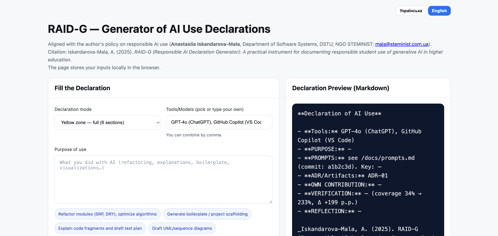

# RAID-G: Responsible AI Declaration Generator

**RAID-G (Responsible AI Declaration Generator)** is an open educational instrument designed by *Anastasiia Iskandarova-Mala* (Department of Software Engineering, Dnipro State Technical University, Ukraine).  
It enables students in higher education to generate structured **Declarations of AI Use** in alignment with the author’s [AI Use in Teaching Policy](../POLICY.md).

---

## 🌐 Access
- **Web generator:** [RAID-G online](https://steminist-ua.github.io/ai-academic-toolkit/raid-g)  
- **Repository:** [ai-academic-toolkit](https://github.com/steminist-ua/ai-academic-toolkit)

---

## ✨ Features
- **Two modes:**
  - *Full declaration* (yellow zone) — six structured sections (Tools, Purpose, Prompts, Contribution, Verification, Reflection).
  - *Light declaration* (green zone) — 5-point checklist for small tasks.  
- **Quick usability:** local storage, quick-insert chips (refactoring, boilerplate, tests, UML, SQL, etc.).  
- **Reproducibility:** Markdown export, coverage delta auto-calculation, links to `prompts.md` and ADRs.  
- **Privacy:** Runs fully client-side; no data leaves your browser.  

---

## 📄 Documentation
Full instruction (LaTeX preprint, arXiv/Zenodo version):  
[`raid-g-instruction.tex`](raid-g-instruction.tex) → compiled PDF for academic citation.

---

## 📚 Citation
If you use RAID-G in your coursework, teaching, or research, please cite as:

> Iskandarova-Mala, A. (2025). RAID-G (Responsible AI Declaration Generator): A practical instrument for documenting responsible student use of generative AI in higher education. Accountability in Research, in press 

You may also append the following note in declarations:
> Generated with RAID-G (Responsible AI Declaration Generator): https://steminist-ua.github.io/ai-academic-toolkit/raid-g

---

## 📜 License
- **Code & Web Tool:** MIT License  
- **Instruction & Documentation:** Creative Commons Attribution 4.0 (CC-BY 4.0)  

---

## 👩‍💻 Author
Developed and maintained by  
**Anastasiia Iskandarova-Mala**  
Dnipro State Technical University (DSTU)  
NGO STEMINIST

# RAID-G: Responsible AI Declaration Generator

[](https://steminist-ua.github.io/ai-academic-toolkit/raid-g)
[](LICENSE)
[](https://creativecommons.org/licenses/by/4.0/)

**RAID-G (Responsible AI Declaration Generator)** is an open educational tool created by *Anastasiia Iskandarova-Mala* (Department of Software Engineering, Dnipro State Technical University, Ukraine).  
It enables students in higher education to generate structured **Declarations of AI Use** in alignment with responsible academic AI policies.

---

## 🌐 Demo
👉 [Use RAID-G online](https://steminist-ua.github.io/ai-academic-toolkit/raid-g)

<p align="center">
  
</p>

---

## ✨ Features
- **Two modes:**
  - *Full declaration* (yellow zone) — six structured sections (Tools, Purpose, Prompts, Contribution, Verification, Reflection).
  - *Light declaration* (green zone) — 5‑point checklist for small tasks.  
- **Quick usability:** local storage, quick‑insert chips (Refactoring, Boilerplate, Tests, UML, SQL, etc.).  
- **Reproducibility:** Markdown export, coverage delta auto‑calculation, links to `prompts.md` and ADRs.  
- **Privacy:** Runs fully client‑side; no data leaves your browser.  
- **Multi‑language:** Ukrainian 🇺🇦 and English 🇬🇧 interface toggle.  

---

## 🚀 Quick Start
1. Open the [RAID-G online generator](https://steminist-ua.github.io/ai-academic-toolkit/raid-g).
2. Fill in the form fields or use quick‑insert chips.
3. Preview your declaration in Markdown.
4. Copy or download the result for submission.

---

## 📄 Example Output
```markdown
**AI Declaration**

- **Tools:** GPT-4o (ChatGPT, 2025-09-15)
- **Purpose:** Refactoring class `Student`
- **Prompts:** See `/docs/prompts.md`
- **Contribution:** Added encapsulation, getters/setters, split .h/.cpp
- **Verification:** Compiled, tested with 3 students
- **Reflection:** AI suggested dynamic memory; simplified to `std::string`
---
Generated with RAID-G (Responsible AI Declaration Generator): https://steminist-ua.github.io/ai-academic-toolkit/raid-g
```

---

## 🎯 Use Cases
- **Students:** Document AI involvement in labs, projects, and theses to demonstrate transparency, reproducibility, and critical evaluation of tools. Supports academic integrity and builds professional digital literacy.
- **Teachers:** Verify integration of AI in coursework, detect undeclared uses, and provide formative feedback. Helps redesign assignments to encourage reflective, responsible AI use and reduce plagiarism risks.
- **Researchers:** Standardize disclosure of AI assistance in coding, writing, or data analysis to align with open science practices. Facilitates reproducibility, peer‑review, and compliance with journal or institutional policies.

---

## 📚 Documentation
- Full academic policy and framework: *AI Use in Teaching Policy* by A. Iskandarova-Mala.  
- Preprint (LaTeX, arXiv/Zenodo, DOI pending): [`raid-g-instruction.tex`](raid-g-instruction.tex).  

---

## 📖 Citation
If you use RAID-G in your coursework, teaching, or research, please cite:

> Iskandarova-Mala, A. (2025). RAID-G (Responsible AI Declaration Generator): A practical instrument for documenting responsible student use of generative AI in higher education. *Accountability in Research*, in press.  

And add this note in declarations:
> Generated with RAID-G (Responsible AI Declaration Generator): https://steminist-ua.github.io/ai-academic-toolkit/raid-g

---

## 🛠️ Tech Stack
- **Frontend:** HTML, CSS, JavaScript  
- **Hosting:** GitHub Pages  
- **No backend, fully client-side**  

---

## 🗺️ Roadmap
- [ ] Add more quick‑insert chips (UX, DB, security)  
- [ ] Support for group projects (multi‑contributor logs)  
- [ ] Integration with GitHub Classroom workflows  
- [ ] Dark mode toggle  

---

## 📜 License
- **Code & Web Tool:** MIT License  
- **Instruction & Documentation:** Creative Commons Attribution 4.0 (CC-BY 4.0)  

---

## 👩‍💻 Author
Developed and maintained by  
**Anastasiia Iskandarova-Mala**  
Department of Software Engineering, Dnipro State Technical University (DSTU)  
NGO STEMINIST  
Email: mala@steminist.com.ua

---